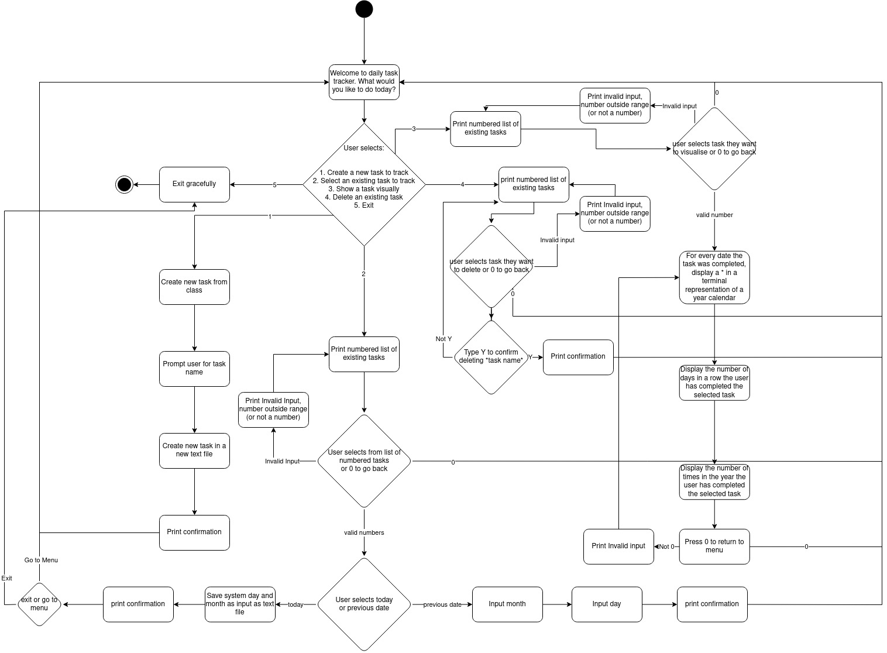
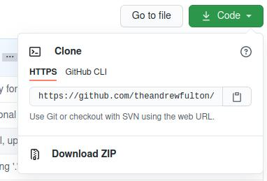

# README - Daily Task Tracker

## Source

The source code for this project is available at [https://github.com/theandrewfulton/terminal-app](https://github.com/theandrewfulton/terminal-app)

## Software Development Plan

### Statement of Purpose and Scope

- describe at a high level what the application will do
- identify the problem it will solve and explain why you are developing it
- identify the target audience
- explain how a member of the target audience will use it

The Daily Task Tracker allows users to create an activity they would like to do every day and then enables them to track it visually. It is inspired by [Simone Giertz's Every Day Calendar](https://www.youtube.com/watch?v=-lpvy-xkSNA).

This enables people to keep track of activities they want to do each day that may form part of a larger goal, such as meditating every day or going for a walk every day. Some people struggle with motivation when it comes to these types of tasks and seeing their progress visually may help with this. The Daily Task Tracker presents this in a simple way.

The target audience for this application is people with long term goals to do something every day, whether it is meditation, exercise, brushing their teeth or making their bed.

Users will create a new task to track. Each day they complete their daily task, they start the app and select that they have completed it. The Daily Task Tracker can then show them this visually and gives them information about how many times throught the year they have achieved their goal, as well as how many times in total. They can also view this visualisation at any time as well as creating new tasks to track and deleting old ones.

### Features

- at least THREE features
- describe each feature

Note: Ensure that your features above allow you to demonstrate your understanding of the following language elements and concepts:
- use of variables and the concept of variable scope
- loops and conditional control structures
- error handling

#### Create a new task to track

Users have the option of creating a new task to track and input a name for a task. For example "Don't bite your nails". The input is saved as the name of an empty text file in order to be persistent when the user exits the application and re-opens it later.

#### Delete a task

Users have the option of deleting tasks they have created in the application. When this option is selected, the application asks for confirmation before deleting the text file that corresponds to the user's input. 

#### Input whether or not the task was completed on a given day

On a given day, users can run the application and mark a task as having been completed for the day. If they forget to log it, they can nominate dates it was completed retroactively. It doesn't have to be marked on the day it happened. When selecting this option, the user is prompted for the task name, with the input matched to the text files. Depending on user selection, either the current system date, or the user's date input will then be saved to the corresponding text file. This will be persistent when the user exits the application and re-opens it later.

### See task progress visually

The user can see the number of days they have completed the task in a simple visual representation of a calendar in the terminal at any time. They can also see the number of days they have completed their task throughout the year as well as the total number of days they have completed it. Once the user has selected which task they would like to see visually, the corresponding text file is opened and the contents converted to an array. The entries in this array are counted, then any not matching the current year are exculded and the array is re-counted This array is then further processed into a format that the ```terminal-table``` gem recognises. For every entry that contains a particular month, an asterisk (*) is printed in the table row for that month. This table is then generated and displayed alongside statistics about the total number of times the task was completed and the total number of times for the current year.

### User Interaction

- how the user will find out how to interact with / use each feature
- how the user will interact with / use each feature
- how errors will be handled by the application and displayed to the user

After the application is installed, users will have access to this README as well as additional documentation when they type ```./daily-task -h``` or ```./daily-task --help```. Each feature is accessed via menus inside the application that briefly describes each feature and provides the user with prompts. When user input is required from users, they are provided with a prompt and it is made clear what the application is expecting from the input. Most navigation is done with the arrow keys, or typing names. Some inputs require dates or a boolean (Yes/No) response. The application makes it clear which type of response is required from the user.

Error Handling

Errors are handled gracefully by providing useful feedback about the problem, then returning the user to the main menu to re-attempt the input.

### Control Flow Diagram



## Implementation Plan

The implementation plan for this project can be found [on Trello](https://trello.com/b/HWYFRejK/terminal-app)

User stories were added to the Trello board and formed the basis of the features outlined above. These features, along with additional tasks for the purposes of assessment. Each task card was further broken down into a checklist of at least 5 items, and categorised according to priority, whether it was documentation, code or presentation related, and the expected time to complete the task. Each task card was then progressively moved from the To Do, to In Progress to Complete lists as they were worked on. The checklists for each card were also progressively updated to track progress at a more granular level.

## Help Documentation

### Dependencies

Daily Task Tracker has only been tested in a unix-like environment and no guarantees can be made about how well it will run (if at all) on other operating systems. For this reason, if running Windows, it is recommended that it is run inside Ubuntu 20.04 LTS, [available from the Microsoft Store](https://www.microsoft.com/en-au/p/ubuntu-2004-lts/9n6svws3rx71).

Daily Task Tracker requires Ruby to be installed. Installation instructions for various operating systems can be found [in the official documentation](https://www.ruby-lang.org/en/documentation/installation/).


### Installation

Clone the repository with git:

```git clone https://github.com/theandrewfulton/terminal-app.git```


Alternatively you can download and extract the files from Github:



or from the command line:

```bash
wget https://github.com/theandrewfulton/terminal-app/archive/main.zip
unzip main.zip
```
### Running Daily Task Tracker

Open a terminal emulator in the directory you saved the zip file or where you cloned the git repository.

Navigate to the src directory and run ```install-run.sh```:

```bash
cd terminal-app-main/src
./install-run.sh
```

Git tracks whether a file is executable, however if you run into issues here, try making the script executable with ```chmod +x install-run.sh```

This script installs and runs the ```bundler``` gem for Ruby, installs additional gems required by Daily Task Tracker and then launches the application.

### In-application Help

The information in this section can also be accessed with the commands: ```./install-run.sh --help``` and ```./install-run.sh -h```

<!-- Welcome to Daily Task Tracker! When you have finished with this help guide, you can open the application with ./install-run.sh -->

Navigate through the menus using the arrow keys. Then use Enter to make a selection.

When you are prompted to select a task, please ensure you type it exactly and then press Enter. If you type something Daily Task Tracker doesn't understand, you will be returned to the main menu.

If you are prompted to type a date, please ensure it is in the format "YYYY-MM-DD".

Some prompts may require you to answer Yes or No. In this case, you will need to type Y for Yes or N for No, followed by Enter.

If you have any questions or need help, please contact the developer on Twitter at [twitter.com/theandrewfulton](https://twitter.com/theandrewfulton)

Thank you and have fun!