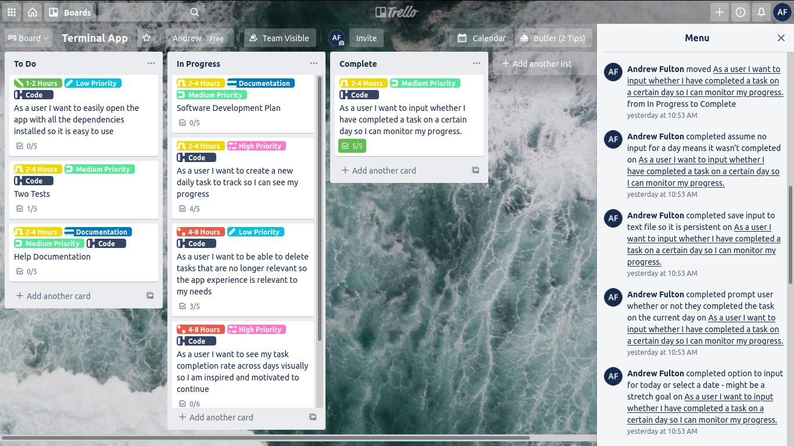
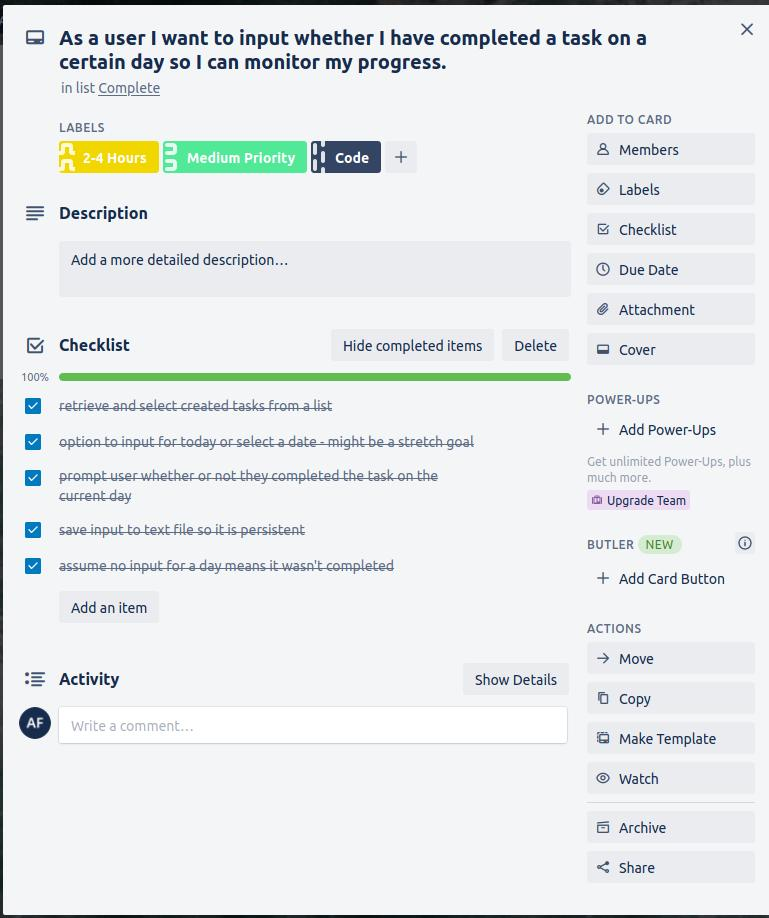
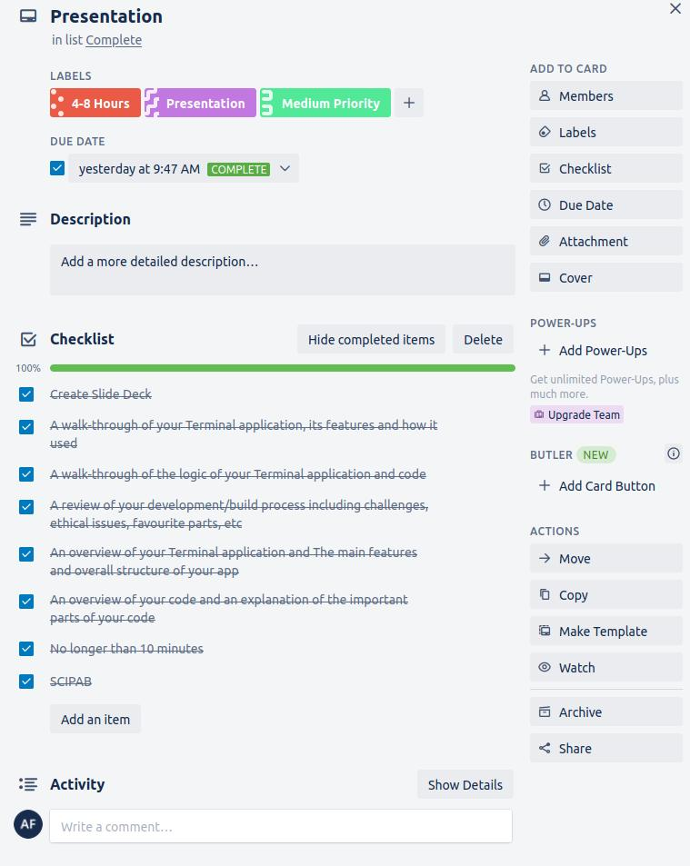
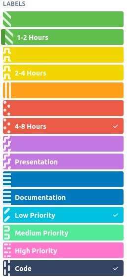

# README - Daily Task Tracker

## Source

Daily Task Tracker is written in Ruby.

The source code for this project is available at [https://github.com/theandrewfulton/terminal-app](https://github.com/theandrewfulton/terminal-app)

## Gems

The following gems are utilised as part of this application:

### Bundler

[Bundler](https://bundler.io/) is used to manage and install the other required gems. It is installed as part of the ```install-run.sh``` script and then invoked to install additional gems required by Daily Task Tracker.

### TTY::Prompt

[TTY::Prompt](https://github.com/piotrmurach/tty-prompt) enables all of the menus in Daily Task Tracker, including confirmations. TTY::Prompt is also used to parse date inputs from users and for error handling.

### Pastel

[Pastel](https://github.com/piotrmurach/pastel) is used as a dependency for TTY::Prompt but is also used to colour various backgrounds, in addition to the confirmation, error and information messages throughout the application.

### ASCII Arty

[ASCII Arty](https://github.com/miketierney/artii) provides ASCII art for the main menu and for the calendar year.

### Terminal Table

[Terminal Table](https://github.com/tj/terminal-table) is used to format and present the output when a task is visualised.

## Testing

One of the limitations of using automated testing suites such as rspec is the difficulty of configuring it to track output. For this reason and due to time constraints, a manual testing regime was created instead. This scheme can be found in ```testing.md``` in the src folder. It outlines several tests for ensuring that the create task and modify task features are working as expected.

## Software Development Plan

### Statement of Purpose and Scope

The Daily Task Tracker allows users to create an activity they would like to do every day and then enables them to track it visually. It is inspired by [Simone Giertz's Every Day Calendar](https://www.youtube.com/watch?v=-lpvy-xkSNA).

This enables people to keep track of activities they want to do each day that may form part of a larger goal, such as meditating every day or going for a walk every day. Some people struggle with motivation when it comes to these types of tasks and seeing their progress visually may help with this. The Daily Task Tracker presents this in a simple way.

The target audience for this application is people with long term goals to do something every day, whether it is meditation, exercise, brushing their teeth or making their bed.

Users will create a new task to track. Each day they complete their daily task, they start the app and select that they have completed it. The Daily Task Tracker can then show them this visually and gives them information about how many times throught the year they have achieved their goal, as well as how many times in total. They can also view this visualisation at any time as well as creating new tasks to track and deleting old ones.

### Features and User Interaction

#### Create a new task to track

From the main menu users have the option of creating a new task to track and input a name for a task. For example "Don't bite your nails". They are prompted for an input which is saved as the name of an empty text file in order to be persistent when the user exits the application and re-opens it later. This input can only contain letters, numbers, spaces and apostophes as it is used to create text files in a unix-like filesystem and different characters (particularly forward-slashes and full stops) cause the naming scheme to break. When a user attempts to use these characters, they are presented with an error message informing them of the allowed characters. The application then checks the user input against the existing text files for a match. If a match is found, the user is informed of this and returned to the main menu. If no match is found, a text file is created with the user's input for a name.

#### Delete a task

From the main menu, users have the option of deleting tasks they have created in the application. When this option is selected, the text files are made more human readable and then made selectable using the arrow keys. The application asks for confirmation before deleting the text file that corresponds to the user's selection. 

#### Input whether or not the task was completed on a given day

From the main menu, users can mark a task as having been completed for the day. If they forget to log it, they can nominate a previous date. It doesn't have to be marked on the day it happened. When selecting this option, a list of tasks is generated from the available text files for the user to select using the arrow keys. Once selected, the user is then further prompted whether they would like to mark the task as complete on the current date, or a previous date. If the user selects the current date, the current system date in ISO8601 format is used. If the user selects a different date, they are prompted to enter a date. This input is parsed into ISO8601 format. If the application cannot parse a recognisable date, it informs the user and allows them to re-input a date until it can be recognised.
The contents of the text file are converted into an array. If the date matches an element already in the array the user is presented with an error message informing them they have already added this date and they are returned to the main menu. If the date inputted occurs after the current system date, the application informs them of this and returns them to the main menu. If the new date is not a duplicate, it is added to the array and the array is written back to the text file as a string.

#### See task progress visually

From the main menu, users can see the number of days they have completed the task in a simple visual representation of a calendar in the terminal at any time. They can also see the number of days they have completed their task throughout the year as well as the total number of days they have completed it. A list of tasks is generated from the available text files and can be selected by the user using the arrow keys. The text file corresponding to the selection is opened and the contents converted to an array. The entries in this array are counted, then any not matching the current year are excluded and the array is re-counted. This array is then further processed into a format that the ```terminal-table``` gem recognises. For every entry that contains a particular month, an asterisk (*) is printed in the table row for that month. This table is then generated and displayed alongside statistics about the total number of times the task was completed and the total number of times for the current year. The table is decorated with ASCII text of the current year. When the user has finished looking at their visual progress, pressing space or enter returns them to the main menu.

After the application is installed, users will have access to this README as well as additional documentation when they type ```./daily-task.sh -h``` or ```./daily-task.sh --help```. Each feature is accessed via menus inside the application that briefly describes each feature and provides the user with prompts. When user input is required from users, they are provided with a prompt and it is made clear what the application is expecting from the input. Most navigation is done with the arrow keys. Some inputs require dates or a boolean (Yes/No) response. The application makes it clear which type of response is required from the user.

### Control Flow Diagram


#### Differences between the diagram and the final product

Instead of numbered inputs, the final version of Daily Task Tracker utilises the ```tty-prompt``` gem as a more elegant solution. As a result much of the error handling loops displayed in this diagram were no longer required as users are no longer presented with many occasions where invalid input is possible as they select options from menus. The options to return to previous menus was not implemented due to time constraints but is a feature that would significantly improve the user experience. In order to more quickly get this application to MVP level, a task class was not implemented. Future work should implement this as it will likely simplify the code and allow more complex command line arguments. Many of the methods have already been significantly refactored. Other minor changes include the wording of prompts.

## Implementation Plan

The implementation plan for this project can be found [on Trello](https://trello.com/b/HWYFRejK/terminal-app)

User stories were added to the Trello board and formed the basis of the features outlined above. These features, along with additional tasks for the purposes of assessment. Each task card was further broken down into a checklist of at least 5 items, and categorised according to priority, whether it was documentation, code or presentation related, and the expected time to complete the task. Each task card was then progressively moved from the To Do, to In Progress to Complete lists as they were worked on. The checklists for each card were also progressively updated to track progress at a more granular level.

The trello board as at the 18th December 2020:


An example of checklist completion from the trello card for the task tracking feature:




And another example from the Presentation card:



The list of available labels for Trello Cards is as follows:



Some of the checklist items have not been marked as complete, despite cards having been moved into the Complete column. This was mainly for items that were not part of the MVP where there was not enough time for the feature to be implemented. In other cases, this was due to the application needs or a certain way something was to be implemented ended up being changed. The original checklist items were kept as a record of this.

## Help Documentation

### Dependencies

Daily Task Tracker has only been tested in a Unix-like environment and no guarantees can be made about how well it will run (if at all) on other operating systems. For this reason, if running Windows, it is recommended that it is run inside Ubuntu 20.04 LTS, [available from the Microsoft Store](https://www.microsoft.com/en-au/p/ubuntu-2004-lts/9n6svws3rx71). The Microsoft Store page also provides instructions on installing Windows Subsystem for Linux.

Daily Task Tracker requires Ruby to be installed. Installation instructions for various operating systems can be found [in the official documentation](https://www.ruby-lang.org/en/documentation/installation/).

### Installation

Clone the repository with git:

```git clone https://github.com/theandrewfulton/terminal-app.git```


Alternatively you can download and extract the files from Github:


or from the command line:

```bash
wget https://github.com/theandrewfulton/terminal-app/archive/main.zip
unzip main.zip
```
### Running Daily Task Tracker

Open a terminal emulator in the directory you saved the zip file or where you cloned the git repository.

Navigate to the src directory and run ```install-run.sh```:

```bash
cd terminal-app-main/src
./install-run.sh
```

Git tracks whether a file is executable, however if you run into issues here, try making the script executable with ```chmod +x install-run.sh```

This script installs and runs the ```bundler``` gem for Ruby, installs additional gems required by Daily Task Tracker and then launches the application.

### In-application Help

The information in this section can also be accessed with the commands: ```./install-run.sh --help``` and ```./install-run.sh -h```

Navigate through the menus using the arrow keys. Then use Enter to make a selection.

When it comes to inputting dates, the application parses your input into ISO8601 format. It is rather good, however for the best experience please enter dates in the format 'YYYY-MM-DD'

Some prompts may require you to answer Yes or No. In this case, you will need to type Y for Yes or N for No, followed by Enter.

The following command line prompts can also be used as a shortcut to the selection menu of each feature:
- -n, --new
    - Opens a dialogue allowing the user to add a new task to track. Once confirmed, opens the main menu.
- -c, --complete
    - Opens a dialogue allowing the user to select a task to mark as complete and prompts for the date. Application exits.
- -v, --view
    - Opens a dialogue allowing the user to select a task to see visualised. The calendar view is then shown. When the user is finished the application exits.
- -d, --delete
    - Opens a dialogue allowing the user to select a task to delete. Once confirmed, application exits.
- -h , --help
    - Displays this help section

If you have any questions or need help, please see the README located in the application's main directory or contact the developer on Twitter at [twitter.com/theandrewfulton](https://twitter.com/theandrewfulton)

Thank you and have fun!